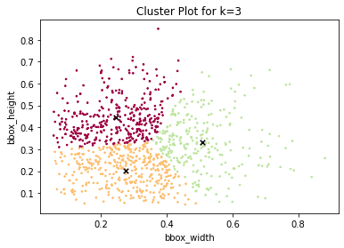
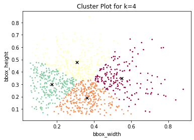
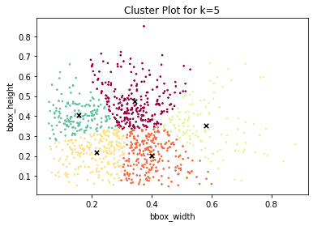
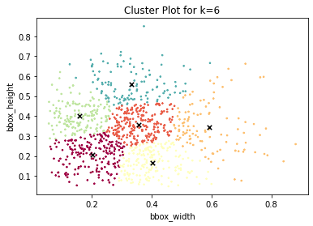
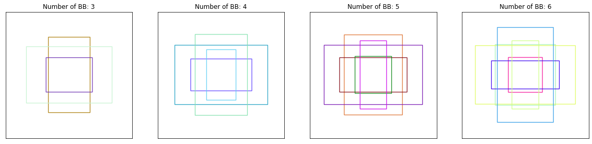
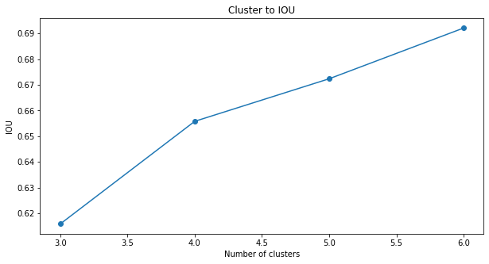
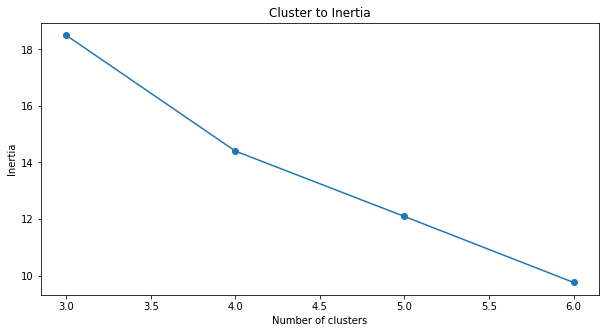

<br/>
<h1 align="center">Session 10: OBJECT LOCALISATION
<br/>
<!-- toc -->
    <br>
    
[](https://lbesson.mit-license.org/)
[](https://github.com/RajamannarAanjaram/badges/)
[](https://github.com/RajamannarAanjaram/badges)
    <br>
[](https://www.python.org/)
[](https://GitHub.com/RajamannarAanjaram/)

### Contributors

<p align="center"> <b>Team - 6</b> <p>
    
| <centre>Name</centre> | <centre>Mail id</centre> | 
| ------------ | ------------- |
| <centre>Amit Agarwal</centre>         | <centre>amit.pinaki@gmail.com</centre>    |
| <centre>Pranav Panday</centre>         | <centre>pranavpandey2511@gmail.com</centre>    |
| <centre>Rajamannar A K</centre>         | <centre>rajamannaraanjaram@gmail.com</centre>    |
| <centre>Sree Latha Chopparapu</centre>         | <centre>sreelathaemail@gmail.com</centre>    |\\

<!-- toc -->
    
## Problem Statement
This is readme file for Part-2 assignment

1. Download [this](https://canvas.instructure.com/courses/2734471/files/143709949?wrap=1) download file. 
2. Learn how COCO object detection dataset's schema is. This file has the same schema. You'll need to discover what those number are.
3. Identify these things for this dataset:
    1. readme data for class distribution (along with the class names) along with a graph
    2. Calculate the Anchor Boxes for k = 3, 4, 5, 6 and draw them.
    3. Share the calculations for both via a notebook uploaded on your GitHub Repo
    
#### Data Structure:
    
Meta data of the text file can be seen [here](https://cocodataset.org/#format-data) under **Object Detection**
    
```
id: 0, height: 330, width: 1093, bbox:[69, 464, 312, 175],

id - Image Id
height - Image Original Height
width - Image Original Width
bbox - Bounding Box in COCO format (x, y, width, height)
```
    
#### Anchor Box and K-values
    
**What are Anchor Boxes**<br/>
    Anchor boxes are nothing but template bounding boxes. Object detection models utilize the anchor boxes to make beter bounding box predictions. YOLO V2 and V3 comes with a set of pre-defined anchor boxes which may not work out of box for custom data. Defining anchor boxes for the custom data will tune the model better and increase object detection accuracy
    
    
<p align="center">
  
  
  
  
</p>

 <div class="row">
  <div class="column">
    
  </div>
</div>  
    
#### Mean IoU and Centroid
<p align="center">
  
  
</p>

#### References
https://gist.github.com/jinyu121/e530dc9767d8f83c08f3582c71a5cbc8
