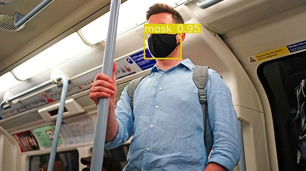
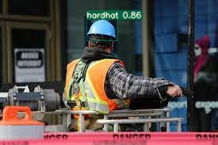
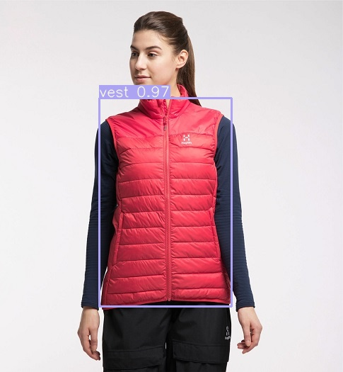

 
<h1 align="center">Yolov3 Object Detection on Custom Dataset
 
<!-- toc -->
     

     

### Dataset Preparation
    
Dataset has 4 classes `Hardhat`, `Mask`, `Vest`, `Boots`. This repo is trained on this [dataset](https://drive.google.com/file/d/1sVSAJgmOhZk6UG7EzmlRjXfkzPxmpmLy/view?usp=sharing) and in addition to these images, 25 images for each class is downloaded and added to the above data.
    
### Data Annotation
Refer to this [repo](https://github.com/miki998/YoloV3_Annotation_Tool) for annotating the images. File structure for image annotaion is as below.
    

    |── images
    |   ├──img-001.jpg
    |   ├──img-002.jpg
    |   ├──...
    ├── classes.txt
    ├── main.py
    ├── process.py
    
run `main.py` to load the annotation tool and `process.py` to create `test.txt` and `train.txt`. Run commands for both are given below.
    

    python3 main.py ## once anotated close the tool
    python3 process.py -args ## args is img path eg: /images

### Downloading pretrained weights
   - Download the file named `yolov3-spp-ultralytics.pt` from [here](https://drive.google.com/open?id=1LezFG5g3BCW6iYaV89B2i64cqEUZD7e0) and place it in [this](YoloV3/weights) directory. 
   - Download the newly trained weights `last.pt` under weights folder for future inference. 
   - For video annotaion use [ffmpeg](https://en.wikibooks.org/wiki/FFMPEG_An_Intermediate_Guide/image_sequence) to extract images from video. 
    
    ffmpeg -i video.webm image-%03d.png

   -  Use the `last.pt` on video frames to make the prediction. Use [ffmpeg](https://en.wikibooks.org/wiki/FFMPEG_An_Intermediate_Guide/image_sequence) to convert images into video again. 
    
    
    ffmpeg -i image-%03d.png video.webm
    
    
 
    
### Training Output
    

  
  

<!-- 

  

 -->

  
  

<!-- 

  

 -->
    
YoloV3 Trained:- [Youtube Video](https://youtu.be/yznqO0pYEYY)  
Train Notebook:- [Model Training notebook](https://github.com/RajamannarAanjaram/TSAI-Assignment/blob/master/11%20Yolo/Custom/CustomYolo.ipynb) 
Yolo Video training:- [Yolo Video annotation](https://github.com/RajamannarAanjaram/TSAI-Assignment/blob/master/11%20Yolo/Custom/YoloVideoPrediction.ipynb)

    

### Contributors

| <centre>Name</centre> | <centre>Mail id</centre> |
| ------------ | ------------- |
| <centre>Amit Agarwal</centre>         | <centre>amit.pinaki@gmail.com</centre>    |
| <centre>Pranav Panday</centre>         | <centre>pranavpandey2511@gmail.com</centre>    |
| <centre>Rajamannar A K</centre>         | <centre>rajamannaraanjaram@gmail.com</centre>    |
| <centre>Sree Latha Chopparapu</centre>         | <centre>sreelathaemail@gmail.com</centre>    | 
    
    
### References
Yotube video use [here](https://www.youtube.com/watch?v=Nap8t4s0UjQ)
