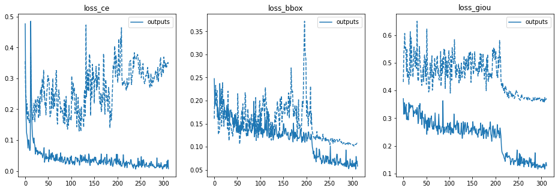
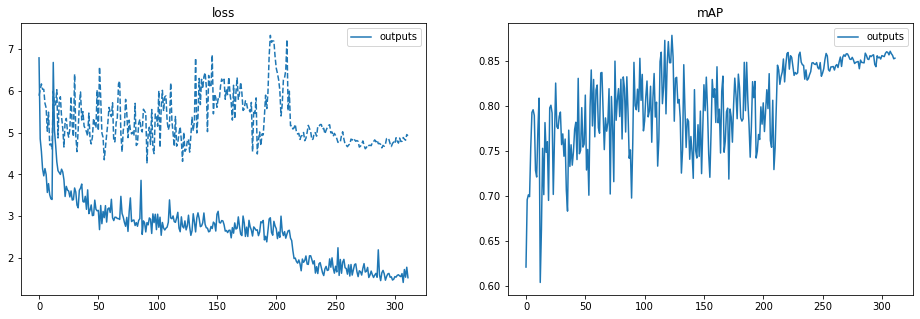
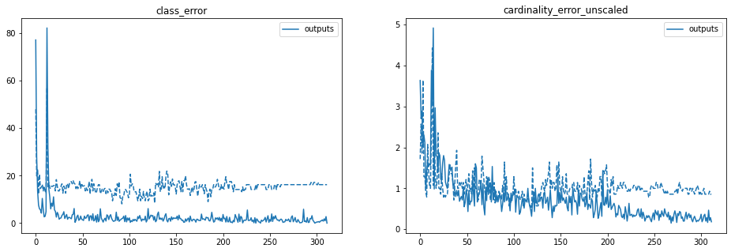
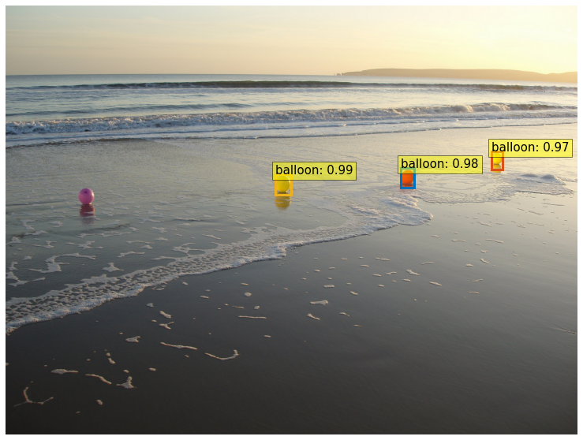

<br/>
<h1 align="center">Session 14: DETR: End-to-End Object Detection with Transformers - PART 1
<br/>
<!-- toc -->
    <br>
    
[](https://lbesson.mit-license.org/)
[](https://github.com/RajamannarAanjaram/badges/)
[](https://github.com/RajamannarAanjaram/badges)
    <br>
[](https://www.python.org/)
[](https://GitHub.com/RajamannarAanjaram/)

<!-- toc -->

## DETR

In am object detection architecture from Facebook for End-to-End Object Detection with Transformers. The architecture is stable without requiring handcrafted configs on number of anchor boxes, anchor box sizes, NMS.
It was build on the intersection of NLP & Computer Vision and changes the horizon of how we detect objects by using Object Queries & Bi-partite loss, hence translating the object detection task to an image-to-set problem.

The training pipeline can be summarised into some major blocks as :
- Calculate image patch features from a Convolution Backbone like ResNet
- Use Encoder-Decoder Transformers to encapsulation and find information using Self-Attention & Cross Attention
- Use bi-partite matchine between predicted and ground-truth objects to remove false or extra detection's.

It makes it really easy to use without any custom layers. The framework easy easy to extend for other tasks in computer vision as well.

### Encoder-Decoder Block

DETR uses both Encoder-Decoder block compared to ViT which only used the Encoder Block.

#### Encoder

- The encoder receives the image patches (feature map) from a Convolution backbone which is of high dimension.
- It uses a 1x1 convolution to reduce the number of channels and then flattens it.
- Then a fixed positional embedding is added which can either be sine wave or a learned embedding. It makes the model permutation invariant
- The encoder layer consists of a standard architecture made of multi-head self-attention layer and a feed forward network with RELU activation.
- Finally we get the Key-Value-Query matrix . The Key & Value serve as a memory bank which is passed to the decoder block

#### Decoder

- The decoder block is a standard transformer decider with the only dfference that queries are not processed sequentially but in parallel.
- It mean that all the objects are detected in one shot from by the decoder.
- The deocer has three inputs :
    - The Key-Value embedding from the encoder's output
    - Input positional embedding which is shared with the Encoder
    - Output positional embeddin which are the Object queries to find where are the object located
- The decoder receives queries (initially set to zero), object queries and key-value from encoder and finally locates objects (class labels) and their bounding boxes through multi-head self attention and encoder-decoder cross attention.

### Object Queries

- The decoder receives a learnable object query (default 100) which is the output positional embedding.
- These object queries are responsible to find objects in the image via interacting with the Key-Value output of the encoder
- The object queries work independently and are decoded into BBox corrdinates and class labels via a  feed forward network resulting in N (100 here) final predictions.
- This infact eliminates the need to NMS as the object queries learn to find the best object irrespective of class, i.e. the Object Queries are not tied to find only one class.
- Using self and cross attention, the model finds the object based on entire image context using the pair wise relation between them.

### Bi-partite Loss & it's Requirement

- The final predictions are unordered and not in the same order of the ground truth we have.
- This is where Bi-partite matching and loss helps us solve the problem.
- It reduces the problem to set problem in a Biparite Graph. Whereby, the best predictions are matched to the best groundtruth, and there can exist only one to one mapping.
- Thus we have to find the best predicted box for a given ground truth. This eliminates need of NMS & Anchor boxes
- We also have to inlcude an additional class of No Object for the other predicted boxes to be matched to.
- The matching is between predicted and ground truth is done across permutations of N elements so as to get the lowest cost.
- The matching takes into consideration both the class labels (classification) and bounding boxes (regression)
- Finally Hungarian loss is used to compute the cost of matching

### Fine Tune DETR
    
DETR will be fine-tuned for **Balloon** custom dataset dataset is taken from [here](https://github.com/matterport/Mask_RCNN/releases/download/v2.1/balloon_dataset.zip). The balloon dataset is annotated in VIA format. However, to prepare the annotations for the model, DETR expects them to be in COCO format. There are 61 images in the training set, and 13 images in the validation set.

The following Github [repo](https://github.com/RajamannarAanjaram/TSAI-Assignment/tree/master/14%20DETR/VIA2COCO) is used to convert annotations from VIA format to COCO format. 

The directory structure should be as following:
```
path/to/coco/
├ annotations/  # JSON annotations
│  ├ annotations/custom_train.json
│  └ annotations/custom_val.json
├ train2017/    # training images
└ val2017/      # validation images
```

### Training Log

Model Training log can be found [here](https://colab.research.google.com/drive/1Erj3Zh8GK8qtiAOm3t2uXwHXRBqeY305#scrollTo=I8qftNNVmJaF&line=4&uniqifier=1). The Model is ran for 300 epochs.

### Custom Notebook

Notebook Link : https://github.com/RajamannarAanjaram/TSAI-Assignment/blob/master/14%20DETR/Object_Detection_DETR.ipynb <br/>
Colab link : https://colab.research.google.com/drive/1Erj3Zh8GK8qtiAOm3t2uXwHXRBqeY305#scrollTo=I8qftNNVmJaF

### Model Results

Training Metrics
    



    
<p align="center">
  
  
</p>
    
### Contributors

    
| <centre>Name</centre> | <centre>Mail id</centre> | 
| ------------ | ------------- |
| <centre>Amit Agarwal</centre>         | <centre>amit.pinaki@gmail.com</centre>    |
| <centre>Pranav Panday</centre>         | <centre>pranavpandey2511@gmail.com</centre>    |
| <centre>Rajamannar A K</centre>         | <centre>rajamannaraanjaram@gmail.com</centre>    |
| <centre>Sree Latha Chopparapu</centre>         | <centre>sreelathaemail@gmail.com</centre>    |\\
    
    
    
### Reference
    
- https://github.com/facebookresearch/detr
- https://opensourcelibs.com/lib/finetune-detr

