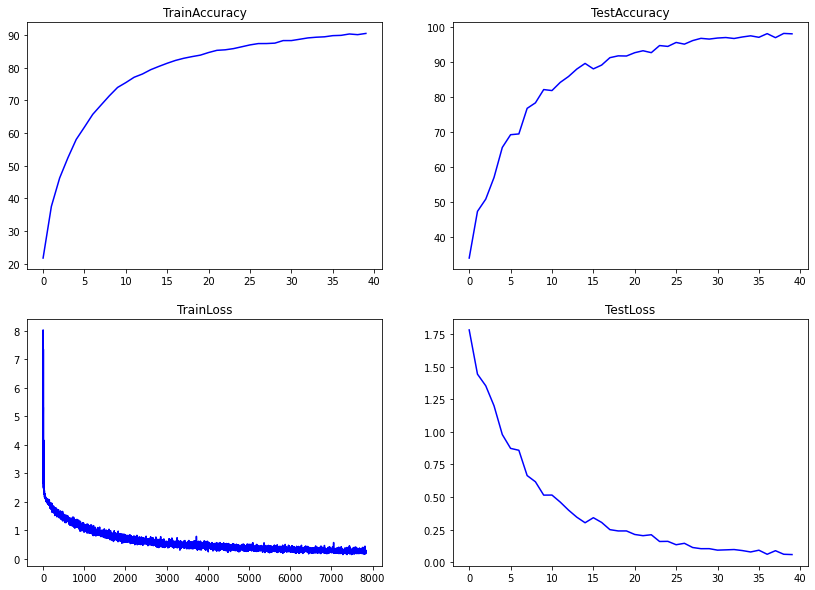

 
<h1 align="center">Session 8: Advanced training Concepts
 
<!-- toc -->
     
    

     

### Contributors

 <b>Team - 6</b> 

    
| <centre>Name</centre> | <centre>Mail id</centre> | 
| ------------ | ------------- |
| <centre>Amit Agarwal</centre>         | <centre>amit.pinaki@gmail.com</centre>    |
| <centre>Pranav Panday</centre>         | <centre>pranavpandey2511@gmail.com</centre>    |
| <centre>Rajamannar A K</centre>         | <centre>rajamannaraanjaram@gmail.com</centre>    |
| <centre>Sree Latha Chopparapu</centre>         | <centre>sreelathaemail@gmail.com</centre>    |\\

<!-- toc -->
    
## Problem Statement

* Check this Repo out: https://github.com/kuangliu/pytorch-cifar (Links to an external site.)
* You are going to follow the same structure for your Code from now on. So Create:  
    * models folder - this is where you'll add all of your future models. Copy resnet.py into this folder, this file should only have ResNet 18/34 models. Delete Bottleneck Class
    * main.py - from Google Colab, now onwards, this is the file that you'll import (along with model). Your main file shall be able to take these params or you should be able to pull functions from it and then perform operations, like (including but not limited to):
        1) training and test loops
        2) data splits between test and train
        3) epochs
        4) batch size
        5) which optimizer to run
        6) do we run a scheduler?
    * utils.py file (or a folder later on when it expands) - this is where you will add all of your utilities like:
        1) image transforms.
        2) gradcam.
        3) misclassification code.
        4) tensorboard related stuff.
        5) advanced training policies, etc, etc.  

* Name this main repo something, and don't call it Assignment8. This is what you'll import for all the rest of the assignments. Add a proper readme describing all the files.

### **The assignment is to build the above training structure. Train ResNet18 on Cifar10 for 20 Epochs. The assignment must:**
* Pull your Github code to google colab (don't copy-paste code)
prove that you are following the above structure
that the code in your google collab notebook is NOTHING.. barely anything. 
* There should not be any function or class that you can define in your Google Colab Notebook. Everything must be imported from all of your other files
* your colab file must:
  * train resnet18 for 20 epochs on the CIFAR10 dataset
  * show loss curves for test and train datasets
  * show a gallery of 10 misclassified images
  * show gradcam output on 10 misclassified images
  
Remember if you are applying GradCAM on a channel that is less than 5px, then please don't bother to submit the assignment. 😡🤬🤬🤬🤬

 

 

## Model training log

0%|          | 0/196 [00:00<?, ?it/s]
Epoch 1:
Loss=4.8126325607299805 Batch_id=3 Accuracy=8.98:   2%|▏         | 4/196 [00:01<00:54,  3.50it/s]

Loss=1.7805640697479248 Batch_id=195 Accuracy=21.71: 100%|██████████| 196/196 [00:53<00:00,  3.65it/s]
  0%|          | 0/196 [00:00<?, ?it/s]

Test set: Average loss: 1.7834, Accuracy: 16976/50000 (33.95%)

Epoch 2:
Loss=1.4639172554016113 Batch_id=195 Accuracy=37.53: 100%|██████████| 196/196 [00:53<00:00,  3.68it/s]
  0%|          | 0/196 [00:00<?, ?it/s]

Test set: Average loss: 1.4438, Accuracy: 23653/50000 (47.31%)

Epoch 3:
Loss=1.3993583917617798 Batch_id=195 Accuracy=46.23: 100%|██████████| 196/196 [00:53<00:00,  3.67it/s]
  0%|          | 0/196 [00:00<?, ?it/s]

Test set: Average loss: 1.3542, Accuracy: 25406/50000 (50.81%)

Epoch 4:
Loss=1.2189584970474243 Batch_id=195 Accuracy=52.43: 100%|██████████| 196/196 [00:53<00:00,  3.67it/s]
  0%|          | 0/196 [00:00<?, ?it/s]

Test set: Average loss: 1.2006, Accuracy: 28502/50000 (57.00%)

Epoch 5:
Loss=1.2663381099700928 Batch_id=195 Accuracy=58.03: 100%|██████████| 196/196 [00:53<00:00,  3.68it/s]
  0%|          | 0/196 [00:00<?, ?it/s]

Test set: Average loss: 0.9797, Accuracy: 32796/50000 (65.59%)

Epoch 6:
Loss=1.1947579383850098 Batch_id=195 Accuracy=61.83: 100%|██████████| 196/196 [00:53<00:00,  3.68it/s]
  0%|          | 0/196 [00:00<?, ?it/s]

Test set: Average loss: 0.8735, Accuracy: 34615/50000 (69.23%)

Epoch 7:
Loss=0.8666180372238159 Batch_id=195 Accuracy=65.73: 100%|██████████| 196/196 [00:53<00:00,  3.68it/s]
  0%|          | 0/196 [00:00<?, ?it/s]

Test set: Average loss: 0.8589, Accuracy: 34727/50000 (69.45%)

Epoch 8:
Loss=0.9169669151306152 Batch_id=195 Accuracy=68.57: 100%|██████████| 196/196 [00:53<00:00,  3.69it/s]
  0%|          | 0/196 [00:00<?, ?it/s]

Test set: Average loss: 0.6647, Accuracy: 38384/50000 (76.77%)

Epoch 9:
Loss=0.9164234399795532 Batch_id=195 Accuracy=71.39: 100%|██████████| 196/196 [00:53<00:00,  3.68it/s]
  0%|          | 0/196 [00:00<?, ?it/s]

Test set: Average loss: 0.6169, Accuracy: 39172/50000 (78.34%)

Epoch 10:
Loss=0.8422104120254517 Batch_id=195 Accuracy=73.96: 100%|██████████| 196/196 [00:53<00:00,  3.68it/s]
  0%|          | 0/196 [00:00<?, ?it/s]

Test set: Average loss: 0.5144, Accuracy: 41070/50000 (82.14%)

Epoch 11:
Loss=0.6810474991798401 Batch_id=195 Accuracy=75.45: 100%|██████████| 196/196 [00:53<00:00,  3.69it/s]
  0%|          | 0/196 [00:00<?, ?it/s]

Test set: Average loss: 0.5149, Accuracy: 40929/50000 (81.86%)

Epoch 12:
Loss=0.6345974802970886 Batch_id=195 Accuracy=77.08: 100%|██████████| 196/196 [00:53<00:00,  3.69it/s]
  0%|          | 0/196 [00:00<?, ?it/s]

Test set: Average loss: 0.4608, Accuracy: 42098/50000 (84.20%)

Epoch 13:
Loss=0.6479822397232056 Batch_id=195 Accuracy=78.07: 100%|██████████| 196/196 [00:53<00:00,  3.69it/s] 
  0%|          | 0/196 [00:00<?, ?it/s]

Test set: Average loss: 0.3992, Accuracy: 42938/50000 (85.88%)

Epoch 14:
Loss=0.6392731666564941 Batch_id=195 Accuracy=79.40: 100%|██████████| 196/196 [00:52<00:00,  3.70it/s] 
  0%|          | 0/196 [00:00<?, ?it/s]

Test set: Average loss: 0.3450, Accuracy: 44001/50000 (88.00%)

Epoch 15:
Loss=0.5706566572189331 Batch_id=195 Accuracy=80.42: 100%|██████████| 196/196 [00:52<00:00,  3.70it/s] 
  0%|          | 0/196 [00:00<?, ?it/s]

Test set: Average loss: 0.3021, Accuracy: 44808/50000 (89.62%)

Epoch 16:
Loss=0.5380564332008362 Batch_id=195 Accuracy=81.38: 100%|██████████| 196/196 [00:52<00:00,  3.70it/s] 
  0%|          | 0/196 [00:00<?, ?it/s]

Test set: Average loss: 0.3409, Accuracy: 44030/50000 (88.06%)

Epoch 17:
Loss=0.4640633463859558 Batch_id=195 Accuracy=82.24: 100%|██████████| 196/196 [00:53<00:00,  3.70it/s] 
  0%|          | 0/196 [00:00<?, ?it/s]

Test set: Average loss: 0.3046, Accuracy: 44572/50000 (89.14%)

Epoch 18:
Loss=0.5968062877655029 Batch_id=195 Accuracy=82.90: 100%|██████████| 196/196 [00:53<00:00,  3.70it/s] 
  0%|          | 0/196 [00:00<?, ?it/s]

Test set: Average loss: 0.2491, Accuracy: 45632/50000 (91.26%)

Epoch 19:
Loss=0.7953377962112427 Batch_id=195 Accuracy=83.41: 100%|██████████| 196/196 [00:53<00:00,  3.69it/s] 
  0%|          | 0/196 [00:00<?, ?it/s]

Test set: Average loss: 0.2391, Accuracy: 45891/50000 (91.78%)

Epoch 20:
Loss=0.4817561209201813 Batch_id=195 Accuracy=83.86: 100%|██████████| 196/196 [00:52<00:00,  3.70it/s] 
  0%|          | 0/196 [00:00<?, ?it/s]

Test set: Average loss: 0.2393, Accuracy: 45868/50000 (91.74%)

Epoch 21:
Loss=0.48378634452819824 Batch_id=195 Accuracy=84.66: 100%|██████████| 196/196 [00:52<00:00,  3.70it/s]
  0%|          | 0/196 [00:00<?, ?it/s]

Test set: Average loss: 0.2121, Accuracy: 46342/50000 (92.68%)

Epoch 22:
Loss=0.5185325145721436 Batch_id=195 Accuracy=85.33: 100%|██████████| 196/196 [00:53<00:00,  3.70it/s] 
  0%|          | 0/196 [00:00<?, ?it/s]

Test set: Average loss: 0.2028, Accuracy: 46622/50000 (93.24%)

Epoch 23:
Loss=0.503445565700531 Batch_id=195 Accuracy=85.49: 100%|██████████| 196/196 [00:52<00:00,  3.70it/s]  
  0%|          | 0/196 [00:00<?, ?it/s]

Test set: Average loss: 0.2100, Accuracy: 46348/50000 (92.70%)

Epoch 24:
Loss=0.3593609929084778 Batch_id=195 Accuracy=85.85: 100%|██████████| 196/196 [00:52<00:00,  3.70it/s] 
  0%|          | 0/196 [00:00<?, ?it/s]

Test set: Average loss: 0.1582, Accuracy: 47365/50000 (94.73%)

Epoch 25:
Loss=0.27493250370025635 Batch_id=195 Accuracy=86.42: 100%|██████████| 196/196 [00:52<00:00,  3.71it/s]
  0%|          | 0/196 [00:00<?, ?it/s]

Test set: Average loss: 0.1592, Accuracy: 47242/50000 (94.48%)

Epoch 26:
Loss=0.5696168541908264 Batch_id=195 Accuracy=86.99: 100%|██████████| 196/196 [00:53<00:00,  3.70it/s] 
  0%|          | 0/196 [00:00<?, ?it/s]

Test set: Average loss: 0.1332, Accuracy: 47807/50000 (95.61%)

Epoch 27:
Loss=0.4202025532722473 Batch_id=195 Accuracy=87.40: 100%|██████████| 196/196 [00:52<00:00,  3.71it/s] 
  0%|          | 0/196 [00:00<?, ?it/s]

Test set: Average loss: 0.1442, Accuracy: 47566/50000 (95.13%)

Epoch 28:
Loss=0.25165754556655884 Batch_id=195 Accuracy=87.41: 100%|██████████| 196/196 [00:52<00:00,  3.71it/s]
  0%|          | 0/196 [00:00<?, ?it/s]

Test set: Average loss: 0.1119, Accuracy: 48075/50000 (96.15%)

Epoch 29:
Loss=0.4966018795967102 Batch_id=195 Accuracy=87.53: 100%|██████████| 196/196 [00:52<00:00,  3.71it/s] 
  0%|          | 0/196 [00:00<?, ?it/s]

Test set: Average loss: 0.1029, Accuracy: 48396/50000 (96.79%)

Epoch 30:
Loss=0.5117291212081909 Batch_id=195 Accuracy=88.31: 100%|██████████| 196/196 [00:52<00:00,  3.71it/s] 
  0%|          | 0/196 [00:00<?, ?it/s]

Test set: Average loss: 0.1031, Accuracy: 48290/50000 (96.58%)

Epoch 31:
Loss=0.27954739332199097 Batch_id=195 Accuracy=88.32: 100%|██████████| 196/196 [00:53<00:00,  3.68it/s]
Loss=0.3330685496330261 Batch_id=0 Accuracy=90.23:   0%|          | 0/196 [00:00<?, ?it/s]

Test set: Average loss: 0.0917, Accuracy: 48439/50000 (96.88%)

Epoch 32:
Loss=0.27375903725624084 Batch_id=195 Accuracy=88.72: 100%|██████████| 196/196 [00:53<00:00,  3.69it/s]
  0%|          | 0/196 [00:00<?, ?it/s]

Test set: Average loss: 0.0939, Accuracy: 48511/50000 (97.02%)

Epoch 33:
Loss=0.3012119233608246 Batch_id=195 Accuracy=89.13: 100%|██████████| 196/196 [00:52<00:00,  3.70it/s] 
  0%|          | 0/196 [00:00<?, ?it/s]

Test set: Average loss: 0.0963, Accuracy: 48374/50000 (96.75%)

Epoch 34:
Loss=0.37741461396217346 Batch_id=195 Accuracy=89.34: 100%|██████████| 196/196 [00:52<00:00,  3.70it/s]
  0%|          | 0/196 [00:00<?, ?it/s]

Test set: Average loss: 0.0884, Accuracy: 48590/50000 (97.18%)

Epoch 35:
Loss=0.3236469626426697 Batch_id=195 Accuracy=89.47: 100%|██████████| 196/196 [00:53<00:00,  3.69it/s] 
  0%|          | 0/196 [00:00<?, ?it/s]

Test set: Average loss: 0.0776, Accuracy: 48757/50000 (97.51%)

Epoch 36:
Loss=0.57842618227005 Batch_id=195 Accuracy=89.83: 100%|██████████| 196/196 [00:52<00:00,  3.70it/s]   
  0%|          | 0/196 [00:00<?, ?it/s]

Test set: Average loss: 0.0912, Accuracy: 48544/50000 (97.09%)

Epoch 37:
Loss=0.20169028639793396 Batch_id=195 Accuracy=89.91: 100%|██████████| 196/196 [00:52<00:00,  3.70it/s]
  0%|          | 0/196 [00:00<?, ?it/s]

Test set: Average loss: 0.0600, Accuracy: 49069/50000 (98.14%)

Epoch 38:
Loss=0.27679815888404846 Batch_id=195 Accuracy=90.33: 100%|██████████| 196/196 [00:52<00:00,  3.70it/s]
  0%|          | 0/196 [00:00<?, ?it/s]

Test set: Average loss: 0.0874, Accuracy: 48494/50000 (96.99%)

Epoch 39:
Loss=0.23374375700950623 Batch_id=195 Accuracy=90.13: 100%|██████████| 196/196 [00:53<00:00,  3.70it/s]
  0%|          | 0/196 [00:00<?, ?it/s]

Test set: Average loss: 0.0600, Accuracy: 49098/50000 (98.20%)

Epoch 40:
Loss=0.20167402923107147 Batch_id=195 Accuracy=90.50: 100%|██████████| 196/196 [00:52<00:00,  3.70it/s]

Test set: Average loss: 0.0577, Accuracy: 49042/50000 (98.08%)

## Plots

## Misclassifications

Below are examples of some missclassified examples in the test set.  

## Grad-CAM outputs

Below are 10 grad-cam example images for misclasified examples in the test set.  

