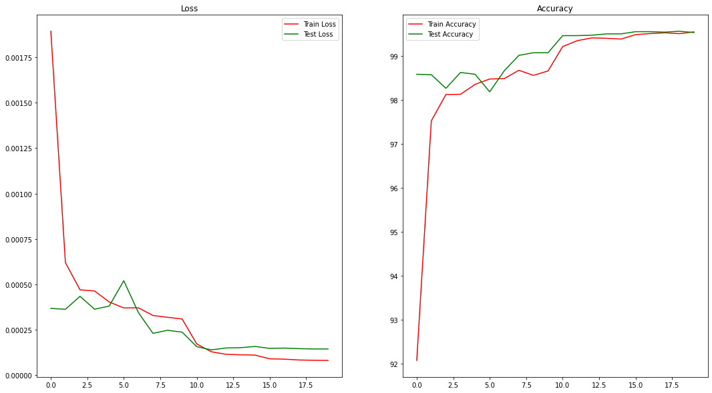

 
<h1 align="center">Session 4: Backpropagation and Architectural Basics</h1>
 

| <centre>Name</centre> | <centre>Mail id</centre> | 
| ------------ | ------------- |
| <centre>Amit Agarwal</centre>         | <centre>amit.pinaki@gmail.com</centre>    |
| <centre>Pranav Panday</centre>         | <centre>pranavpandey2511@gmail.com</centre>    |
| <centre>Rajamannar A K</centre>         | <centre>rajamannaraanjaram@gmail.com</centre>    |
| <centre>Sree Latha Chopparapu</centre>         | <centre>sreelathaemail@gmail.com</centre>    |

1. # Backpropagation
[Readme]() 
[Excel]()

2. # Architectural Basics
[Questions Readme]() 
[Notebook]()

## Model Initialization:

Batch Size = 128  
Epochs = 19

## Final Best Model

- Model has 17K (17,498) parametes
- Used Augmentation like image rotation
- Added Drop out of 0.15 after GAP
- The model was trained with a learning rate of 0.01
- Network was trained for 19 epochs with batch size of 128
- Achieved a test accuracy of 99.4% from 11th epoch onwards

### Model Architecture

    ----------------------------------------------------------------
            Layer (type)               Output Shape         Param #
    ================================================================
                Conv2d-1           [-1, 16, 28, 28]             160
           BatchNorm2d-2           [-1, 16, 28, 28]              32
                  ReLU-3           [-1, 16, 28, 28]               0
                Conv2d-4           [-1, 32, 28, 28]           4,640
           BatchNorm2d-5           [-1, 32, 28, 28]              64
                  ReLU-6           [-1, 32, 28, 28]               0
             MaxPool2d-7           [-1, 32, 14, 14]               0
                Conv2d-8            [-1, 8, 14, 14]             264
           BatchNorm2d-9            [-1, 8, 14, 14]              16
                 ReLU-10            [-1, 8, 14, 14]               0
               Conv2d-11           [-1, 16, 14, 14]           1,168
          BatchNorm2d-12           [-1, 16, 14, 14]              32
                 ReLU-13           [-1, 16, 14, 14]               0
               Conv2d-14           [-1, 32, 14, 14]           4,640
          BatchNorm2d-15           [-1, 32, 14, 14]              64
                 ReLU-16           [-1, 32, 14, 14]               0
            MaxPool2d-17             [-1, 32, 7, 7]               0
               Conv2d-18              [-1, 8, 7, 7]             264
          BatchNorm2d-19              [-1, 8, 7, 7]              16
                 ReLU-20              [-1, 8, 7, 7]               0
               Conv2d-21             [-1, 16, 5, 5]           1,168
                 ReLU-22             [-1, 16, 5, 5]               0
              Dropout-23             [-1, 16, 5, 5]               0
               Conv2d-24             [-1, 32, 3, 3]           4,640
                 ReLU-25             [-1, 32, 3, 3]               0
    AdaptiveAvgPool2d-26             [-1, 32, 1, 1]               0
              Dropout-27             [-1, 32, 1, 1]               0
               Linear-28                   [-1, 10]             330
           LogSoftmax-29                   [-1, 10]               0
    ================================================================
    Total params: 17,498
    Trainable params: 17,498
    Non-trainable params: 0
    ----------------------------------------------------------------
    Input size (MB): 0.00
    Forward/backward pass size (MB): 1.20
    Params size (MB): 0.07
    Estimated Total Size (MB): 1.27
    ----------------------------------------------------------------

### Training Log

    Epoch 1:
    loss=0.0778517 batch_id=467: 100%|██████████| 468/468 [00:13<00:00, 34.55it/s]
    Train Accuracy: 92.07 % 	 Train Loss: 0.0019
    0%|          | 0/468 [00:00<?, ?it/s]
    Test Accuracy: 98.59 % 	 Test Loss: 0.0004
    Number of correct prediction in test set: 9859/10000
    ++++++++++++++++++++

    Epoch 2:
    loss=0.0857671 batch_id=467: 100%|██████████| 468/468 [00:13<00:00, 33.96it/s]
    Train Accuracy: 97.53 % 	 Train Loss: 0.0006
    0%|          | 0/468 [00:00<?, ?it/s]
    Test Accuracy: 98.58 % 	 Test Loss: 0.0004
    Number of correct prediction in test set: 9858/10000
    ++++++++++++++++++++

    Epoch 3:
    loss=0.0484976 batch_id=467: 100%|██████████| 468/468 [00:13<00:00, 34.40it/s]
    Train Accuracy: 98.1283 % 	 Train Loss: 0.0005
    0%|          | 0/468 [00:00<?, ?it/s]
    Test Accuracy: 98.27 % 	 Test Loss: 0.0004
    Number of correct prediction in test set: 9827/10000
    ++++++++++++++++++++

    Epoch 4:
    loss=0.0227978 batch_id=467: 100%|██████████| 468/468 [00:13<00:00, 33.79it/s]
    Train Accuracy: 98.1333 % 	 Train Loss: 0.0005
    0%|          | 0/468 [00:00<?, ?it/s]
    Test Accuracy: 98.63 % 	 Test Loss: 0.0004
    Number of correct prediction in test set: 9863/10000
    ++++++++++++++++++++

    Epoch 5:
    loss=0.0122312 batch_id=467: 100%|██████████| 468/468 [00:13<00:00, 34.61it/s]
    Train Accuracy: 98.36 % 	 Train Loss: 0.0004
    0%|          | 0/468 [00:00<?, ?it/s]
    Test Accuracy: 98.59 % 	 Test Loss: 0.0004
    Number of correct prediction in test set: 9859/10000
    ++++++++++++++++++++

    Epoch 6:
    loss=0.0955839 batch_id=467: 100%|██████████| 468/468 [00:13<00:00, 34.05it/s]
    Train Accuracy: 98.4817 % 	 Train Loss: 0.0004
    0%|          | 0/468 [00:00<?, ?it/s]
    Test Accuracy: 98.19 % 	 Test Loss: 0.0005
    Number of correct prediction in test set: 9819/10000
    ++++++++++++++++++++

    Epoch 7:
    loss=0.0063186 batch_id=467: 100%|██████████| 468/468 [00:13<00:00, 33.77it/s]
    Train Accuracy: 98.4917 % 	 Train Loss: 0.0004
    0%|          | 0/468 [00:00<?, ?it/s]
    Test Accuracy: 98.67 % 	 Test Loss: 0.0003
    Number of correct prediction in test set: 9867/10000
    ++++++++++++++++++++

    Epoch 8:
    loss=0.0293866 batch_id=467: 100%|██████████| 468/468 [00:13<00:00, 34.12it/s]
    Train Accuracy: 98.68 % 	 Train Loss: 0.0003
    0%|          | 0/468 [00:00<?, ?it/s]
    Test Accuracy: 99.02 % 	 Test Loss: 0.0002
    Number of correct prediction in test set: 9902/10000
    ++++++++++++++++++++

    Epoch 9:
    loss=0.0362401 batch_id=467: 100%|██████████| 468/468 [00:13<00:00, 33.43it/s]
    Train Accuracy: 98.565 % 	 Train Loss: 0.0003
    0%|          | 0/468 [00:00<?, ?it/s]
    Test Accuracy: 99.08 % 	 Test Loss: 0.0002
    Number of correct prediction in test set: 9908/10000
    ++++++++++++++++++++

    Epoch 10:
    loss=0.095508 batch_id=467: 100%|██████████| 468/468 [00:13<00:00, 33.85it/s]
    Train Accuracy: 98.665 % 	 Train Loss: 0.0003
    0%|          | 0/468 [00:00<?, ?it/s]
    Test Accuracy: 99.08 % 	 Test Loss: 0.0002
    Number of correct prediction in test set: 9908/10000
    ++++++++++++++++++++

    Epoch 11:
    loss=0.011568 batch_id=467: 100%|██████████| 468/468 [00:13<00:00, 33.77it/s]
    Train Accuracy: 99.22 % 	 Train Loss: 0.0002
    0%|          | 0/468 [00:00<?, ?it/s]
    Test Accuracy: 99.47 % 	 Test Loss: 0.0002
    Number of correct prediction in test set: 9947/10000
    ++++++++++++++++++++

    Epoch 12:
    loss=0.0330705 batch_id=467: 100%|██████████| 468/468 [00:13<00:00, 33.59it/s]
    Train Accuracy: 99.355 % 	 Train Loss: 0.0001
    0%|          | 0/468 [00:00<?, ?it/s]
    Test Accuracy: 99.47 % 	 Test Loss: 0.0001
    Number of correct prediction in test set: 9947/10000
    ++++++++++++++++++++

    Epoch 13:
    loss=0.0067421 batch_id=467: 100%|██████████| 468/468 [00:13<00:00, 34.29it/s]
    Train Accuracy: 99.4183 % 	 Train Loss: 0.0001
    0%|          | 0/468 [00:00<?, ?it/s]
    Test Accuracy: 99.48 % 	 Test Loss: 0.0001
    Number of correct prediction in test set: 9948/10000
    ++++++++++++++++++++

    Epoch 14:
    loss=0.0126215 batch_id=467: 100%|██████████| 468/468 [00:13<00:00, 33.53it/s]
    Train Accuracy: 99.41 % 	 Train Loss: 0.0001
    0%|          | 0/468 [00:00<?, ?it/s]
    Test Accuracy: 99.51 % 	 Test Loss: 0.0002
    Number of correct prediction in test set: 9951/10000
    ++++++++++++++++++++

    Epoch 15:
    loss=0.047155 batch_id=467: 100%|██████████| 468/468 [00:13<00:00, 33.77it/s]
    Train Accuracy: 99.3917 % 	 Train Loss: 0.0001
    0%|          | 0/468 [00:00<?, ?it/s]
    Test Accuracy: 99.51 % 	 Test Loss: 0.0002
    Number of correct prediction in test set: 9951/10000
    ++++++++++++++++++++

    Epoch 16:
    loss=0.0089742 batch_id=467: 100%|██████████| 468/468 [00:14<00:00, 33.42it/s]
    Train Accuracy: 99.4917 % 	 Train Loss: 0.0001
    0%|          | 0/468 [00:00<?, ?it/s]
    Test Accuracy: 99.56 % 	 Test Loss: 0.0001
    Number of correct prediction in test set: 9956/10000
    ++++++++++++++++++++

    Epoch 17:
    loss=0.0033094 batch_id=467: 100%|██████████| 468/468 [00:13<00:00, 33.53it/s]
    Train Accuracy: 99.5167 % 	 Train Loss: 0.0001
    0%|          | 0/468 [00:00<?, ?it/s]
    Test Accuracy: 99.56 % 	 Test Loss: 0.0001
    Number of correct prediction in test set: 9956/10000
    ++++++++++++++++++++

    Epoch 18:
    loss=0.0062471 batch_id=467: 100%|██████████| 468/468 [00:13<00:00, 33.67it/s]
    Train Accuracy: 99.535 % 	 Train Loss: 0.0001
    0%|          | 0/468 [00:00<?, ?it/s]
    Test Accuracy: 99.55 % 	 Test Loss: 0.0001
    Number of correct prediction in test set: 9955/10000
    ++++++++++++++++++++

    Epoch 19:
    loss=0.0044553 batch_id=467: 100%|██████████| 468/468 [00:14<00:00, 33.25it/s]
    Train Accuracy: 99.515 % 	 Train Loss: 0.0001

    0%|          | 0/468 [00:00<?, ?it/s]
    Test Accuracy: 99.57 % 	 Test Loss: 0.0001
    Number of correct prediction in test set: 9957/10000
    ++++++++++++++++++++

    Epoch 20:
    loss=0.0011424 batch_id=467: 100%|██████████| 468/468 [00:13<00:00, 33.44it/s]
    Train Accuracy: 99.555 % 	 Train Loss: 0.0001
    Test Accuracy: 99.54 % 	 Test Loss: 0.0001
    Number of correct prediction in test set: 9954/10000
    ++++++++++++++++++++

## Model Performace:

   

## Reference Links
[Kaggle Notebook]( https://www.kaggle.com/enwei26/mnist-digits-pytorch-cnn-99)
