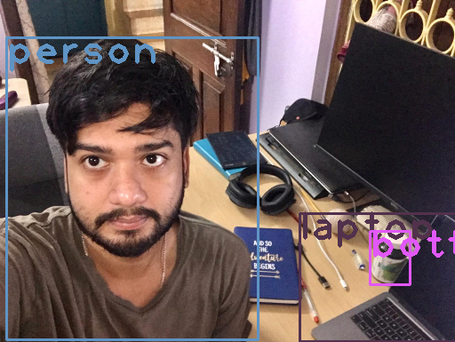

 
<h1 align="center">Session 11: Session 11 - YOLO v1/v2/v3/v4
 
<!-- toc -->
     
    

     

### Contributors

 <b>Team - 6</b> 

    
| <centre>Name</centre> | <centre>Mail id</centre> | 
| ------------ | ------------- |
| <centre>Amit Agarwal</centre>         | <centre>amit.pinaki@gmail.com</centre>    |
| <centre>Pranav Panday</centre>         | <centre>pranavpandey2511@gmail.com</centre>    |
| <centre>Rajamannar A K</centre>         | <centre>rajamannaraanjaram@gmail.com</centre>    |
| <centre>Sree Latha Chopparapu</centre>         | <centre>sreelathaemail@gmail.com</centre>    |\\

<!-- toc -->
    
## Problem Statement
This is readme file for Part-1 assignment

PART-1 OpenCV Yolo: [SOURCE](https://pysource.com/2019/06/27/yolo-object-detection-using-opencv-with-python/) 
1. Run this above code on your laptop or Colab. 
2. Take an image of yourself, holding another object which is there in COCO data set (search for COCO classes to learn). 
3. Run this image through the code above. 
4. Upload the link to GitHub implementation of this
5. Upload the annotated image by YOLO. 

## Method:
Downloaded the source, weights and config files from [here](https://pysource.com/2019/06/27/yolo-object-detection-using-opencv-with-python/) and collected images with different objects to run on the code. The images captured are run for different confidence levels like 0.2, 0.5, 0.8 to observe the image predictions and the results [here]()

Input Images:

  
  
  

Ojects predicted:

  
  
  

    
